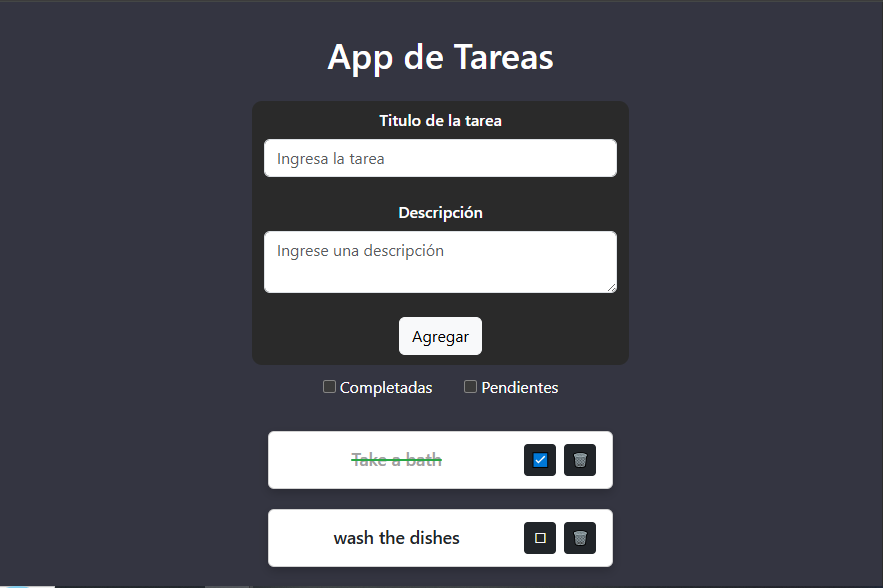

# ToDoApp

Proyecto con frontend y backend separados.

---

## Cómo correr el proyecto

### Backend

```bash
cd server
npm install
npm start
```

### Frontend

```bash
cd client
npm install
npm start
```

---

## Notas

- Debés tener Node.js y npm instalados.
- Añadir el archivo [ARCHIVO.ENV](#archivoenv) en la carpeta server
- Se recomienda primero hacer correr el backend para que la API esté disponible.
- Luego hacer correr el frontend para que se pueda usar la aplicación en el navegador.

---
## ARCHIVO.ENV
El archivo .env almacena configuraciones sensibles o específicas del entorno, como la cadena de conexión a MongoDB.


Creá un archivo llamado .env en la raíz del proyecto y escribe lo siguiente:
```
# Cadena de conexión a MongoDB
MONGO_URI=mongodb+srv://<usuario>:<contraseña>@cluster0.abcd.mongodb.net/<bbdd>?retryWrites=true&w=majority

//Reemplaza <usuario>, <contraseña> y <bbdd> por las credenciales reales:
Usuario: lrpmqrp
Contraseña: pZm2ez9wtjjFRWCK
bbdd: todos

# Puerto donde correrá el servidor
PORT=5000


## Preview


